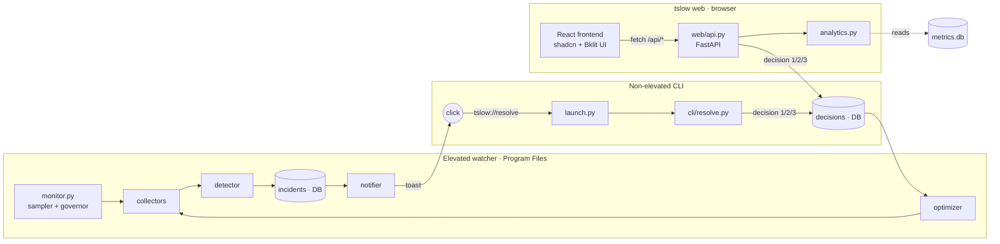
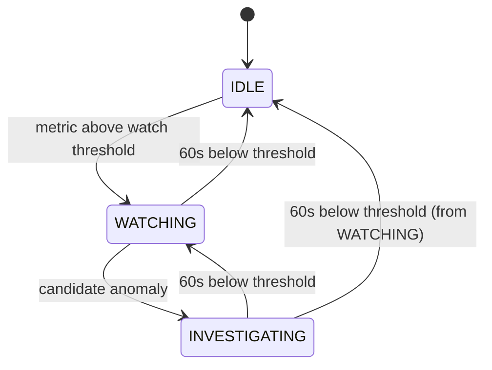

# Architecture

## Context and requirements
ASUS VivoBook S15 X510UF laptop (i5-8250U 4C/8T at 15 W, **7.9 GB RAM**, SATA SSD 256 GB, MX130 + UHD 620 GPU), Windows 11, ~220 active processes. Needs a Python 3.12 monitor that runs in the background with negligible impact, finds the process causing a slowdown, alerts with a native notification, lets the user decide from the CLI, and learns from their choices. Historical dashboard both as a TUI (Textual + plotext) and on the web (`tslow web`: FastAPI + React/shadcn/Bklit UI, M6), both over the same `analytics.py`.

## Q&A decisions (2026-09-13)
| Topic | Decision |
|---|---|
| Dashboard | Web (FastAPI + React/Bklit UI) over `analytics.py`. The terminal dashboard (Textual + plotext) existed M4–M7 and was removed in M8 |
| Privileges | **Admin** watcher started by Task Scheduler at logon |
| Install | Copy into `C:\Program Files\TSlow` with a bundled runtime; installed data and logs live in `%LOCALAPPDATA%\TSlow\{data,logs}` (M7.2); the workspace hosts `data/metrics.db` during development (optionally redirected with `TSLOW_DATA_DIR`, ignored when installed) |
| Children of protected apps | "Free rein" (L1), except above the critical threshold |
| `node.exe` under Claude | Untouchable (L0) |
| [3] Always allow | Auto-applies Soft only; Hard always asks for confirmation |
| [1] Deny | Applies once; 3 consecutive denies → "learned ignore" for 30 days |
| Hard | `WM_CLOSE` → wait 10s (3s if hung or RAM critical) → `kill()` |
| Sensitivity | Balanced + 24h calibration |
| Extra signals | CPU throttling, memory leak, "not responding", per-process GPU |
| Protected culprit | Informational notification, 60 min cooldown |

## Components (diagram)

`tslow web` reads the same history as `cli/dashboard.py` (same `analytics.py`) and, since M6.1, can also **propose** a 1/2/3 decision like `cli/resolve.py` does — same `rules.apply_decision`/`db.create_decision`, no duplicated logic. `web/api.py` never executes an action on a process directly: that's always and only the elevated watcher via `optimizer.apply()` (see Security model), which re-validates protection and identity regardless of which channel (CLI or web) wrote the decision.

## Adaptive sampler states


## Decision flow
```mermaid
sequenceDiagram
    participant Det as detector.py (watcher)
    participant DB as metrics.db
    participant Not as notifier.py
    participant CLI as tslow resolve (user)
    participant Opt as optimizer.py (watcher)

    Det->>DB: create incident (open)
    Det->>Not: request notification
    Not-->>CLI: toast → click → tslow://resolve
    CLI->>DB: read incident
    CLI->>DB: write decision [1|2|3]
    Opt->>DB: read decisions (poll 1s)
    Opt->>Opt: validate identity + protection + dry-run
    Opt->>DB: actions_log (outcome)
```

## Protection levels
See `src/tslow/protection.py`. Windows system names (L0) and maintenance names (L2) are hardcoded and never configurable; protected *apps* come from the `[protection]` section of `settings.toml` (M7.3). Summary:
- **L0 – untouchable**: core Windows processes and `explorer.exe` (hardcoded); apps listed in `[protection] untouchable`; `untouchable_children` pairs (child only when running under that ancestor); the tslow watcher itself.
- **L1 – free rein**: descendants of apps in `[protection] free_rein_parents`. Only the critical level asks for confirmation.
- **L2 – Soft only**: system maintenance processes (Windows Update, Search Indexer, VM host, etc.), hardcoded.
- **L3 – normal**: everything else.
Check order in `classify`: system L0 → user `untouchable` → `untouchable_children` → L2 → user L1 → L3. Inspect with `tslow protection` (read-only).

## Action pipeline (`optimizer.apply()`)
1. Check protection level.
2. Process identity (PID + create time + exe path).
3. Decision validity (the watcher's own incident, open, allowed level).
4. Dry-run check.
5. Execution.
6. Post-action verification.
7. Row in `actions_log`.

## Security model
- The DB is the only channel between the watcher and non-elevated clients (the CLI, and since M6.1 the web dashboard too): both can only write a *proposed* decision into `decisions`, never execute an action directly. The watcher treats the DB as untrusted input. Since M7.2 the data folder (`%LOCALAPPDATA%\TSlow`) is user-writable **by design** (the non-elevated CLI must write decisions into it): that is exactly why the DB is untrusted and protection is never read from it.
- System/maintenance protection lives only in code; the user's protected apps live only in the admin-writable `settings.toml` — never in the DB or any user-writable path.
- The installed runtime runs from Program Files with `pythonw.exe -I`, never from the dev workspace.

## ADR (technical decisions)
- **WMI kept out of the sampling loop**: every WMI query loads `WmiPrvSE.exe`, i.e. the Observer Effect the tool needs to avoid. Used only for inventory, culprit enrichment, and ACPI temperature.
- **`NtQuerySystemInformation` (ctypes) instead of `psutil.process_iter`**: a single system-wide snapshot for every process (~2-4 ms for 220 processes) versus tens of ms iterating `psutil.Process` one by one. Falls back to `psutil.process_iter` if ctypes parsing fails.
- **PDH with `win32pdh.AddEnglishCounter`**: Windows in Italian translates counter names in the UI; the English API avoids depending on the system language.
- **Windows-Toasts instead of win10toast**: `win10toast` breaks on Python ≥3.11 (`WPARAM is simple`) and is abandoned. `plyer` as a fallback, then log-only.
- **Bklit UI deferred to M6**: it's a React/shadcn library for the web, unusable in a Python CLI; M0-M5 use a Textual + plotext TUI over the same `analytics.py` that will later serve the FastAPI backend.
- **CPU shown differs from Task Manager**: Task Manager uses "% Processor Utility" (accounts for real frequency with Turbo Boost/power saving), tslow samples "% Processor Time" via PDH/psutil. The two numbers can diverge, especially under thermal throttling or power saving — expected, not a bug.

## Known limits
- Per-process network attribution is heuristic (no per-process counter in psutil/WMI), shown as "low confidence"; ETW deferred past the MVP.
- An admin process running modifiable code without UAC is an escalation path: that's why the installed runtime is isolated in Program Files and started with `-I`.
- ACPI temperature (`wmi_info.acpi_temperature_celsius`) needs elevated privileges: from a non-elevated process, access to `MSAcpi_ThermalZoneTemperature` is denied (verified). Works once the watcher runs elevated from the scheduled task (M5); until then it returns `None` without errors.
- `metrics_raw.gpu_percent` is the busiest GPU engine at that instant, not the sum of all engines (see ADR below): a high value doesn't imply a single process is causing it, attribution needs `collectors.gpu.aggregate_per_pid` (M2).

## Additional ADRs (M9 — updater and GitHub release)
- **Check automatically, install only with consent.** The watcher is elevated, so new code must never land in Program Files without an explicit OK. `updater.check_for_update` runs in a background thread (no effect on the sampling loop), at most every `[updates] check_interval_hours` (24), only when `[updates] repository` is a real `owner/name` (shipped as `glingus/tslow`; the old placeholder `OWNER/tslow` still means off), and shows one toast per new version. `tslow update` (administrator terminal, installed copy only) re-fetches everything from GitHub, shows the version, asks for confirmation, then `install.update` stops the scheduled task (pywin32 keeps DLLs open), reinstalls dependencies and the package into the existing runtime, refreshes `settings.default.toml`, the web build and the `tslow.cmd` shim, and always starts the task again. `settings.toml` (and so `[protection]`/`[watcher]`) and the data folder are never touched. `tslow update --check` needs no admin and installs nothing.
- **Trust model**: the repository comes from the admin-only `settings.toml`, never from the DB (the `app_settings` keys `update_last_check_ms`, `update_available`, `update_notified` are only a reminder cache: `tslow update` ignores them). Assets must live under `https://github.com/<repo>/releases/download/`; the zip is accepted only if its SHA-256 equals the entry in the same release's `SHA256SUMS`; the archive is extracted with a zip-slip guard and a 200 MB download cap. Honest limit: there is no signature, so this protects against corrupt or swapped assets but not against a compromised GitHub account or repository owner. Only the standard library (`urllib`) is used: no new dependency.
- **Release pipeline**: `.github/workflows/release.yml` on a `vX.Y.Z` tag (must equal `pyproject.toml`'s version) runs the tests, builds `web/dist`, packs `tslow-X.Y.Z.zip` (src, config, `web/dist`, `requirements.lock`, `pyproject.toml`, README, LICENSE) and `SHA256SUMS`, and publishes both: exactly what the updater looks for. `ci.yml` runs the suite on Windows and the web build on every push/PR. The pack → verify → extract → `pip install` path was rehearsed locally against a fake release.

## Additional ADRs (M8 — closing the open decisions)
- **Real actions on the installed watcher via `settings.toml`**: `[watcher] dry_run` (default `true`). `monitor.resolve_dry_run`: an explicit `tslow daemon --dry-run/--no-dry-run` wins, otherwise the setting; any value other than a real boolean `false` stays dry-run. Why the file and not an installer flag: installed, `settings.toml` is admin-writable only (the same property that protects `[protection]`), turning actions on is a deliberate edit that survives reinstalls (M7.5 keeps the file), and no reinstall is needed to turn them back off. The scheduled task is unchanged (`tslow daemon`); restart the task after editing. `tslow status` prints the configured mode. The config-error fail-safe from M7.3 still forces dry-run.
- **English DB enums (migration 0004) and English `settings.toml` keys**: done now because nobody else has data yet. SQLite can't alter a `CHECK`, so `metrics_raw` and `incidents` are rebuilt inside one transaction with foreign keys off (children untouched, AUTOINCREMENT counters carried over), preceded by an automatic `VACUUM INTO` backup. Rehearsed on a copy of the real workspace DB (18,945 samples, 13 incidents): counts equal, `foreign_key_check` and `integrity_check` clean. `ProtectionLevel` members and the sampler state names were renamed too. **Compatibility**: a database migrated by the new code can't be read by the old installed watcher — reinstall before (or together with) running new code against the live DB. An old `settings.toml` keeps working but its renamed keys are ignored (defaults apply); the watcher logs a warning naming them (`config.legacy_keys`) and `settings.default.toml` is the reference. Rename pattern: `calmo_tick`→`idle_tick`, `isteresi_discesa_secondi`→`hysteresis_drop_seconds`, `critico_*`→`critical_*`, `anomalia_*`→`anomaly_*`, `colpevole_*`→`culprit_*`, `*_secondi/_minuti/_giorni/_ore`→`*_seconds/_minutes/_days/_hours`, `[thresholds.disco/rete]`→`[thresholds.disk/network]`, `[notifiche]`→`[notifications]`, `[azioni]`→`[actions]`, `crescita_mb_min`→`growth_mb_per_min`, `soglia_mb_min`→`threshold_mb` (see `config/settings.toml` for the full set).
- **One dashboard: the web one.** The terminal dashboard (`cli/dashboard.py`, `tslow dashboard`, Textual + plotext, `BLUEPRINT_CSS`) was removed: two UIs over one `analytics.py` doubled the maintenance, and only the web dashboard can act on incidents. This also drops `textual`, `plotext` and their transitive dependencies (`requirements.lock` regenerated from the extras with the previous pins as constraints: −`textual`, `plotext`, `linkify-it-py`, `mdit-py-plugins`, `platformdirs`; `pip check` clean). Needing Node to build the web dashboard stays (decision: no prebuilt `web/dist` for now).

## Additional ADRs (M7.6 — pandas and numpy dropped)
- **Why**: the heaviest dependencies by far, used only to read a few thousand rows and average them. Removing them shrinks the install and the `pip` step, and makes `tslow status`/`tslow web` start faster.
- **`analytics.py` on `sqlite3` + stdlib**: functions return `list[dict]` (`load_metrics` returns a `MetricRows` list that also remembers the column names, so `metric_column` still resolves `cpu_percent` vs `cpu_percent_avg` on an empty range, exactly as the empty DataFrame did). `trend` is a plain least-squares slope; `with_moving_averages` is a time-window mean over `(ts - window, ts]` that skips `None` (windows are now milliseconds, not pandas offset strings). Missing values are `None`, never `NaN`.
- **Same JSON, verified**: before touching anything, every `web/api.py` read endpoint (4 ranges × 6 endpoints, plus `nasa`/`decisions/{id}`/`health`) was dumped from a deterministic seeded temp DB (~5,800 raw samples with NULL gaps); the same dump after the rewrite is identical — same keys, same lengths, worst relative difference 5e-11 (running-sum float drift in the moving averages). Floats are still rounded to 10 decimals, as pandas' `to_json` did.
- **`requirements.lock`**: instead of regenerating from scratch (which would also have bumped fastapi/starlette/uvicorn and pulled a new transitive `opentelemetry-api`), the tested pins were kept and only `numpy`, `pandas`, `python-dateutil`, `six`, `tzdata` (pandas-only) removed; verified in a clean temporary venv: `pip install -r requirements.lock` + `pip check` clean, `pip freeze --all` identical to the file, and every module imports.

## Additional ADRs (M7.5 — installer fixes)
- `requirements.lock` is no longer git-ignored: `install._install_dependencies` reads it, so a fresh clone couldn't install without it.
- `install._write_settings` never overwrites an existing `C:\Program Files\TSlow\settings.toml` (it holds the user's `[protection]` list, see M7.3); the shipped defaults are always rewritten next to it as `settings.default.toml`. Every `settings.get(...)` has a code default, so an older file keeps working.
- `tslow.cmd` shim (`build_cli_shim`, one line: `@"<runtime>\python.exe" -I -m tslow %*`) written to `%LOCALAPPDATA%\Microsoft\WindowsApps` (on PATH by default; skipped if the folder is missing) and removed by `uninstall`. It runs the installed, isolated runtime, never the dev workspace. Written as bytes so Windows doesn't turn `\r\n` into `\r\r\n`.
- `uninstall` states that the database and logs in `%LOCALAPPDATA%\TSlow` stay.

## Additional ADRs (M7.3 — configurable protection list)
- **Why**: the first developer's own apps (`chrome`, `claude`, `code`, `node` under `claude`) were hardcoded as untouchable for everybody. Decision of 2026-10-06: protected *apps* become configurable; Windows system and maintenance lists stay in code.
- **Why Program Files preserves the model**: installed, `settings.toml` is `C:\Program Files\TSlow\settings.toml`, writable only by an administrator, so a non-elevated process (or a poisoned DB) can't lower protection. The data folder, by contrast, is user-writable and untrusted.
- **L2 before the user's L1**: configuration may only add protection, never make a hardcoded entry killable (e.g. `TrustedInstaller` under a free-rein parent stays Soft-only).
- **Fail-safe**: `monitor.init_protection` loads the section eagerly; on `ProtectionConfigError` it logs an ERROR, installs an empty `UserProtection` and forces `dry_run=True` for that run. A broken protection file never leads to a real action.
- Tests use an autouse fixture (`tests/conftest.py`) that installs the legacy lists, so older tests stay meaningful.

## Additional ADRs (M7.2 — data and log location)
- Installed data/logs moved from the first developer's `Desktop\tslow` to `%LOCALAPPDATA%\TSlow\{data,logs}` (fallback `~\AppData\Local\TSlow`). The scheduled task runs as the logged-on user, so the elevated watcher and the non-elevated CLI resolve the same folder and both can write it. Dev mode is unchanged, plus `TSLOW_DATA_DIR` (dev only; the installed runtime ignores it, so an environment variable can't redirect the elevated watcher). No automatic migration: the old DB at `Desktop\tslow\data\metrics.db` can be copied by hand while the watcher is stopped (README, M7.7).

## Additional ADRs (M7.1 — incident lifecycle and decision polling)
- **The bug**: any open incident forced `tick_period = min(tick_period, 1.0)` so decisions were read quickly. Incidents with `proposed_action='nessuna'` (L0 processes, throttling, system events) can never receive a decision, so they stayed `'aperto'` forever and the watcher did full sampling at 1 Hz for good — measured on both PCs (real gap ~1.0 s with a configured 5 s idle tick). It also defeated the overhead governor and the battery tick.
- **Fix 1 — TTL expiry**: `db.expire_stale_incidents` (called from `_flush`, every 60 s) closes open incidents older than `[incidents] expire_after_minutes` (default 30) as `'scaduto'`, unless a decision is still `pending`. Chosen over tracking "is the condition still true" per incident: one `UPDATE`, no new state; if the slowdown persists the detector simply opens a new incident and the notifier cooldowns prevent spam.
- **Fix 2 — polling decoupled from sampling**: `monitor.wait_for_next_tick` sleeps the whole remaining period in one go, unless `db.has_actionable_open_incident` (open and `proposed_action != 'nessuna'`); then it wakes every ≤1 s to run the indexed `list_pending_decisions` query and, only if something is pending, takes a fresh process snapshot used for that decision alone (the detector's `prev_process_snapshots` are untouched). No code path makes the sampling period depend on open incidents.

## Additional ADRs (M6 — web dashboard, done)
- **`analytics.metric_column()` and a retroactive bug in `cli/dashboard.py`**: the `metrics_1m`/`metrics_1h` rollups (24h/7d/30d ranges) only expose metrics as `<name>_avg`/`<name>_max`, never under the direct name used by `metrics_raw` (1h). `cli/dashboard.py` (M4) always indexed by the direct name: live, on the production DB, it showed "n/a" and "no data" for **any range other than 1h**, including the **default** (24h) of `tslow dashboard` — with 520 real rows available in `metrics_1m`. Neither M4's visual check nor the tests caught it (`test_dashboard_metric_and_range_keys_do_not_crash` covers 24h but only checks it doesn't crash). Fixed with a shared pure function (tries the direct name, then the `_avg` suffix) used by both the TUI and the web API, so the same logic doesn't diverge in two places.
- **`sqlite3.Connection` across FastAPI's pool threads**: sync `Depends` and the sync endpoint run in `anyio`'s threadpool (`run_in_threadpool`), with no guarantee of staying on the same OS thread between the dependency that opens the connection and the endpoint that uses it. With `database.connect()`'s default settings this raises `sqlite3.ProgrammingError` on every request (found while writing the tests, before any real use — see Task_Log). `database.connect()` now has an optional `check_same_thread` parameter (default `True`, unchanged for the CLI/watcher/existing tests); the web API passes `False`, safe because each connection is only ever used by one thread at a time anyway.
- **Localhost bind by default, no authentication**: consistent with a local single-user tool; an explicit `--host` other than localhost prints a warning instead of refusing (no multi-machine use case in the plan). CORS limited to `localhost`/`127.0.0.1` origins on any port, for the frontend's dev-mode Vite server — irrelevant in production since the bind itself stays local.
- **Bklit UI confirmed as a real library**: open-source chart/data-viz components on top of shadcn/ui (line/area/ring/radar chart), with its own registry installable via the shadcn CLI from `ui.bklit.com`, React 19 + Tailwind 4 + Visx stack. The original brief's technical correction ("Bklit UI is a React/shadcn library for the web, not usable in a Python CLI") was therefore accurate about a concrete library, not a generic name. Their docs claim two steps are "automatic" that in practice weren't: the `@bklit` registry in `components.json` (added by hand) and the `shimmering-text` dependency of the chart components (installed by hand via the CLI). One installed component (`chart-loading-label.tsx`) also had a broken relative import (pointing at a folder that doesn't exist): fixed in the copied file, consistent with the shadcn model where installed code is your own, not an opaque dependency you leave untouched.
- **Vite + React instead of Next.js**: Bklit UI is native to Next.js, but `tslow web` needs neither server-side rendering nor multi-page routing (it's a single dashboard). Vite produces only static assets (`web/dist`), which `web/api.py` mounts with `StaticFiles` — no extra Node process in production, consistent with the goal of a single process (`tslow web`) for the end user.
- **A historical read-only API over `analytics.py`, one endpoint per public function**: that's how it was born in M6 — no action on processes and no writing of decisions from the web, that channel was exclusively `tslow resolve`. **Revised in M6.1** (see ADR below): it's still true the API never executes anything on processes, but it can now write a proposed decision, exactly like the CLI.
- **A fixed "Blueprint" theme, not a switchable light/dark one**: every shadcn color variable (which normally distinguishes a light `:root` from a dark `.dark`) was overridden to the same two pure values (`#000000`/`#ffffff`) in both blocks. For this product, black has been the visual identity since M0 (TUI, Windows Terminal scheme), not a system preference to respect — a "light" dashboard would break consistency with the rest of the product without anyone asking for it.
- **Chart throwing `RangeError` on empty data**: the chart library (visx/d3 under Bklit) computes the X-axis time extent even when `data=[]`, gets an invalid Date, and `Intl.DateTimeFormat.format()` on an invalid Date throws `RangeError` instead of returning "Invalid Date" — unlike `toLocaleString()`, which doesn't throw. React 19 unmounts the whole tree under the failing component (black screen, no visible error in the UI, only in the console). Found immediately on the first live check in the browser, not from the build (TypeScript doesn't see this class of error at runtime). Same guard already present in `cli/dashboard.py::_plot_ascii`: never pass empty data to the chart, a text message in its place until `samples.length === 0`.
- **`paths.web_dist_dir()` + `install.py::_copy_web_dist()`**: same pattern as `config_path()`/`INSTALL_DIR` (M1/M5) — the build's location depends on dev vs. installed, never inferred from package depth. Optional by design: if `web/dist` doesn't exist (frontend never built, or install run before this milestone), neither `install()` nor `tslow web` fail — the latter shows a message instead of the page, the API stays reachable regardless.
- **Chart curve, `curveNatural` → `curveLinear`**: the user reported a CPU chart with an unnaturally smooth ("dome") arc over a multi-hour stretch. First verified against the production `data/metrics.db` that the underlying data was genuinely noisy with no gaps (60/60 samples/minute, 4-33% values): not a data problem but a rendering one. Bklit's `<Line>` defaults to `curveNatural` (a cubic spline, `@visx/curve`), which can overshoot between samples with many close, noisy points. Fixed by explicitly setting `curve={curveLinear}` on both lines (value and moving average) in `App.tsx`: straight point-to-point segments, no invented interpolation between samples — consistent with the "blueprint" (technical drawing) look already chosen for the rest of the product.

## Additional ADRs (M6.1 — web actions + overhead chart, done)
- **[1]/[2]/[3] decisions from the browser too, not just `tslow resolve`**: the user's choice after an end-of-M6 status briefing (no milestone planned beyond it, so an explicit chat decision on how to continue — see Task_Log). The endpoint (`POST /api/incidents/{id}/decision`) calls the same `rules.apply_decision`/`db.create_decision` as the CLI: zero duplicated logic, zero new way to execute actions. The watcher stays the only executor, and always re-validates protection + identity regardless of who wrote the row in `decisions`. That's why extending the API from read-only to "can propose decisions" doesn't weaken the security model: the invariant that matters ("only `optimizer.apply()` touches processes, always after re-validation") was never in the API's read-only-ness, but in the watcher.
- **`protection_level`/`proposed_action`/`quota_percent` exposed by `analytics.incident_history`**: already columns of `incidents` since M2, never read by the API before. The frontend needs them to replicate the same rule as `cli/resolve.py` (an L0 or system incident → informational only, no prompt/buttons) without duplicating it server-side in a second place: the real check still lives in the endpoint (404/409), the frontend-side exposure is only so it doesn't show buttons the API would refuse anyway.
- **Discovered by live verification (not derivable from the web endpoint's code alone)**: `monitor.py::_process_pending_decisions` closes the incident (`status='risolto'`) right after **any** decision, regardless of the outcome — pre-existing M3 behavior, never exercised live in this form before. An early version of the frontend forced an immediate refresh after the action (`onActed`); since the incident closes almost right away by the next refresh anyway, that eager refresh wiped the outcome message ("done"/"simulated (dry-run)"/...) before it could be read. Removed: the existing 5s polling is enough, and shows a more stable message.
- **Live verification with `spawn_hog.py`, never on the user's real processes**: a real, already-open incident (not synthetic) was resolved by clicking "Allow once" in the browser; the installed watcher (elevated, real PID) executed it in ~400ms, **re-deriving the group's PIDs from its own current process snapshot** (not from PIDs saved when the incident opened, which in the tested case dated back days and had long since exited) — a detail of `optimizer.py`/`grouping.py`'s existing behavior (M2/M3), here only observed for the first time from a channel other than `tslow resolve`. With the real install still in `--dry-run`, the recorded outcome was correctly `dry_run`: no real action executed.
- **`analytics.overhead_series` separate from `overhead_summary`**: same principle as `load_metrics` (raw series) vs. `trend`/aggregates — one extra query instead of overloading the existing function with a new field, so the text footer (which only uses `overhead_summary`) stays unchanged. Chart with `<AreaChart>`/`<Area>` (Bklit, installed in M6 for `area-chart`/`shimmering-text` but never wired to anything) instead of a second `<LineChart>`, to visually set this secondary section apart from the main chart; `curve={curveLinear}` explicitly set here too (`<Area>`'s default is `curveMonotoneX`, which doesn't produce `curveNatural`'s "dome" artifact, but consistency with the rest of the UI is a deliberate style choice, not just a targeted bugfix).
- **`process_minutes` never populated in production, noticed by inspection**: found while evaluating whether to build the overhead chart on top of this table instead of `monitor_health`. The schema and `database.insert_process_minutes` have existed since M1, but no watcher code ever calls it (verified: 0 rows on a real DB with 73k+ samples). Explicitly deferred to M2 in the original plan along with `grouping.py`, then never picked up again in any later milestone — not a regression from this session, a pre-existing scope gap. Left as-is: it would have needed new aggregation logic in the watcher, outside the scope chosen for this increment (read-only plus a new write channel that already existed elsewhere). **Fixed in M6.2** (see ADR below): `monitor.py::ProcessGroupAccumulator` now writes real rows on every flush.

## Additional ADRs (M6.2 — process_minutes populated, done)
- **`process_minutes` fixed (see the gap noted in M6.1 above)**: `monitor.py::ProcessGroupAccumulator` accumulates each tick's metrics per app-group (same `grouping.build_groups` and the same per-group formulas as the detector) and writes them at the already-existing periodic flush, instead of a separate write path — the same principle already followed elsewhere in the project (one channel, not a new one per feature).
- **Column semantics, deliberately non-uniform**: `cpu_percent_avg`/`cpu_percent_max` are the average/max of the per-tick samples within the minute (like `metrics_1m`); `ram_private_mb_max` is a **peak**, not an average — an average would wash out exactly the kind of growth a per-app leak should surface; `io_bytes_sec`/`gpu_percent` are **averages** (same treatment as `metrics_1m`'s `_avg`-only columns, e.g. `net_rx_bytes_sec_avg`); `instance_count` is the **max** of concurrent PIDs in the group during the minute, because a group's processes can spawn/die within a minute (e.g. a build tool, a worker pool) and an average or the last value would hide the peak. None of these choices were already written down anywhere (the M1 schema only lists column names): decided now, documented in [[Database_Schema]] because it isn't derivable from the column names alone.
- **"Top 10" ranked by `cpu_percent_avg`**: the schema has no "score" column; CPU was chosen because it's already the "primary" resource elsewhere in the project (the detector's first check, the dashboard's first indicator). `monitor._PROCESS_MINUTES_TOP_N = 10` is a module constant, not a `settings.toml` setting: the number is fixed by the table's own name ("top 10 app-groups per minute", from the original plan), not a parameter expected to change.
- **4 `detector.py` functions made public instead of duplicated**: `group_cpu_percent`/`group_ram_private_mb`/`group_io_bytes_sec`/`group_gpu_percent` (were `_group_*`, private) encapsulate non-obvious correctness rules already fixed once (e.g. discarding a reused PID by checking `create_time` before computing a delta). Rewriting them in `monitor.py` would have risked silently losing that same protection. Renamed with no behavior change; no test imported them by their private name (checked before renaming).
- **Live verification on an isolated DB instead of the installed watcher**: the real watcher in Program Files was already running during the session (single-instance mutex held, confirmed with `tslow status`), so starting `tslow daemon --foreground` from the dev workspace against the same `data/metrics.db` would have failed immediately on the mutex — and that installed copy doesn't have this change yet anyway (needs a reinstall, see Task_Log). Instead of stopping the real monitoring in progress, a disposable script drove the same real path by hand (`processes_collector.snapshot`, `protection.is_own_process`, `ProcessGroupAccumulator`, `monitor._flush`) against an isolated temp DB: genuinely real system data (87 app-groups on this machine), zero risk to the production watcher. The `python` group generated by `spawn_hog.py cpu --workers 4` reached `cpu_percent_max=50.00`, which matches the physical prediction exactly (4 workers each saturating one core out of 8 logical cores) — independent confirmation the arithmetic is correct on real data.

## Additional ADRs (M5 — install, real run pending confirmation)
- **`requirements.lock` from a clean venv, not `pip freeze` on the dev venv**: the dev venv also has `pytest`/`coverage`/`pytest-asyncio` (the `dev` extra), which aren't needed in the Program Files runtime and would needlessly bloat its dependencies. Generated instead from a temporary venv with only `.[daemon,cli]`.
- **`paths.INSTALL_DIR` as a fixed constant instead of walking up from `PACKAGE_DIR`**: after `pip install`, `tslow/` ends up nested inside `runtime\Lib\site-packages\tslow`, much deeper than the dev workspace (`src/tslow`). A fixed `.parent` in `config_path()`'s code (written in M1, before M5's details were defined) pointed inside `site-packages` instead of at `C:\Program Files\TSlow\settings.toml`. Bug found by inspection while writing `install.py`, fixed with a constant known up front, covered by `tests/test_paths.py`.
- **Pure functions kept separate from the ones that touch the system**: `build_scheduled_task_xml`, `build_windows_terminal_fragment`, `protocol_registry_entries` are tested directly; `_copy_runtime`/`_install_dependencies`/`_register_scheduled_task`/`_register_protocol`/`_write_windows_terminal_fragment` (which copy files, call `schtasks`, write to the registry) aren't covered by automated tests and never run without the user explicitly confirming in chat, on top of the confirmation prompt (`typer.confirm`) and elevation check already present in the `tslow install`/`tslow uninstall` commands.
- **Bug found live: `ensurepip`/`pip` in `_install_dependencies` without `-I`**: without isolation, the copied runtime also saw the installing account's user site (`%APPDATA%\Python\Python312\site-packages`, shared by any Python 3.12 interpreter on the machine, not just this one). During the real install, `pip list` in the runtime showed `pipx` — never declared in `requirements.lock` — installed by the non-elevated user. It's the same escalation path the watcher's `-I` flag already guards against (see Known limits), here also applying to the pip calls run during install itself. Fixed by adding `-I` to every `ensurepip`/`pip` call; re-verified with a second `tslow install` run that the runtime's `pip list` matches `requirements.lock` + `tslow` exactly.
- **Confirming elevation by the absence of information, not its presence**: from a non-elevated process, `Get-Process`/`Get-CimInstance Win32_Process` can't read the installed watcher's `pythonw.exe` `Path`/`CommandLine` (they come back empty, no error) — that's UIPI hiding a higher-integrity process's details from a lower one. It's an indirect but expected confirmation that the watcher really does run elevated, consistent with `RunLevel=HighestAvailable` in the registered XML; a direct confirmation needs an equally elevated session.

## Additional ADRs (M4 — verified on this machine)
- **`plotext` pinned to `<6.0`**: an unconstrained resolve installed 6.1.0, which rewrote the whole API around a canvas/pixel model (`plt.figure.line(position, ...)`) meant for generic graphics, no longer a fit for a simple time-series chart with `plt.plot(x, y)`. Pinned `plotext>=5.3,<6.0` in `pyproject.toml`; the classic API (`clear_figure`/`theme`/`plotsize`/`title`/`plot`/`build`) verified against real data.
- **Visual check via `App.export_screenshot()` (Textual)**: with no way to interactively inspect a full-screen TUI, the dashboard was verified by seeding a preview DB and exporting an SVG screenshot from the app's `run_test()` — confirmed pure black background, pure white text, and every panel consistent with the seeded data (indicators, chart, top-offenders, incidents, overhead).
- **`db_path` exposed on `DashboardApp`'s constructor**: the clean way to isolate tests (`test_dashboard.py`) and generate previews from a real DB (`data/metrics.db`) without touching production data during development.

## Additional ADRs (M3 — verified on this machine)
- **`optimizer.py` doesn't trust the `proposed_action` already saved on the incident**: it always reclassifies the process's protection at execution time (defense in depth). Verified with a test that forces `proposed_action='soft'` on an L0 name: it's still refused.
- **`dry_run` guard bug found live**: a temporary M1/M2 safety block (`if not dry_run: dry_run = True`) had been left in the code and made `--no-dry-run` a silent no-op — the log explicitly said "not supported yet" but no error was raised. Found only by running the live end-to-end test (real watcher + `tslow resolve`), not by unit tests. Removed now that all of M3's tests are green; the CLI command's default stays `--dry-run` (safe).

## Additional ADRs (M2 — verified on this machine)
- **`IsHungAppWindow` isn't exposed by this version of `win32gui`**: called via ctypes into `user32.dll` instead (`collectors/windows.py`).
- **`dwm.exe` can have a transient main window flagged "hung" for a single tick** (observed live during the M2 test with `spawn_hog.py hung`, likely during another window's open/close animation: DWM doesn't process messages like a normal app). That's why `detector._check_hung` always excludes L0 processes **before** opening an incident: a system component is never an actionable target for "not responding". Regression covered by `tests/test_detector.py::test_hung_not_reported_for_l0_process`.
- **`signal.SIGTERM` wasn't handled**: stopping the watcher any way other than Ctrl+C (KeyboardInterrupt) skipped the final flush of the in-memory buffer, losing up to 60s of `metrics_raw` (observed: Git Bash's `timeout` kills the process without running the `finally` block). A SIGTERM handler now re-raises `KeyboardInterrupt` to reuse the same clean-shutdown path. A forced `TerminateProcess` still can't be intercepted by any Windows process: an accepted residual risk, mitigated by incidents and baselines being written immediately (autocommit), with no buffering.

## Additional ADRs (M1 — verified on this machine)
- **`SYSTEM_PROCESS_INFORMATION` layout (ctypes)**: compared field by field against `psutil` across all 227 active processes on this machine (name + create_time): 100% match except 3 expected, documented cases in `tests/test_processes.py` (`System`: psutil zeroes out create_time; `Secure System`: psutil can't read the name, a VBS-protected process; `Memory Compression`: psutil's internal alias). `tslow bench` measures ~3ms for the ctypes snapshot versus **~1.2 seconds** for the `psutil.process_iter` fallback on 227 processes — empirical confirmation of the architectural choice.
- **`win32pdh.AddEnglishCounter`**: every planned counter (`% Processor Performance`, `% Performance Limit`, `% Committed Bytes In Use`, `Page Reads/sec`, `Avg. Disk sec/Transfer`, `Current Disk Queue Length`, `Processor Queue Length`) validated and read correctly on Windows in Italian.
- **Per-process GPU**: `\GPU Engine(*)\Utilization Percentage` via `win32pdh.AddCounter` + `GetFormattedCounterArray` (not `AddEnglishCounter`: the counter name is already in English with no known localized alternative form). The PID is in the instance name (`pid_<PID>_luid_..._eng_<N>_engtype_<Type>`); this machine shows 349-358 concurrently active instances (MX130 + UHD620).
- **`bench`**: the real cost measured on this machine is `system.collect` ~9ms, `pdh.sample` ~1.8ms, `gpu.sample_raw` ~0.7ms, `processes.snapshot_via_ntquery` ~3ms, `wmi_info.collect_inventory` ~70ms (one-off). All well under the governor's overhead budget.
