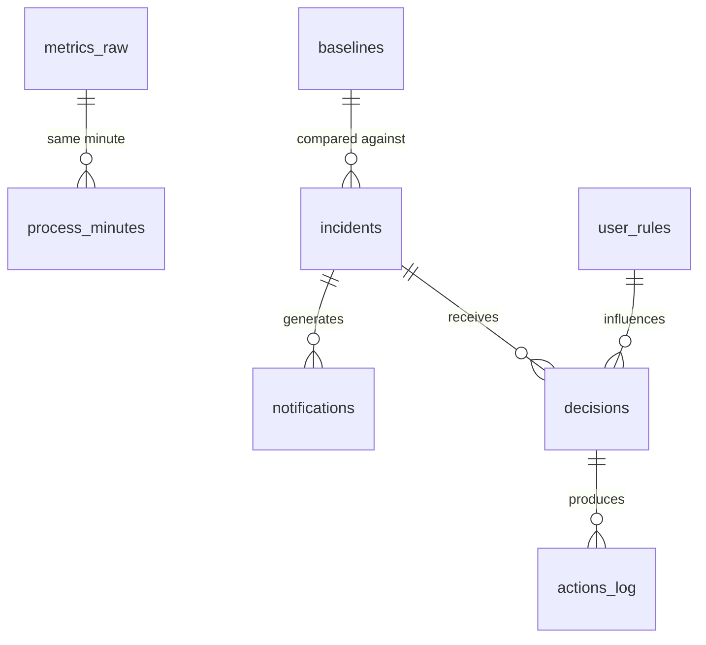

# Database Schema

`data/metrics.db` (SQLite, WAL). Created at runtime by `src/tslow/database.py`, migrations applied via `PRAGMA user_version` (see `tests/test_database.py`, also verified against the real watcher).

M4 (dashboard) introduces no new tables: `analytics.py` (used by the web dashboard) only reads existing tables (`metrics_raw`/`metrics_1m`/`metrics_1h`, `incidents`, `decisions`, `monitor_health`), never writing.

## PRAGMA
`journal_mode=WAL` · `synchronous=NORMAL` · `foreign_keys=ON` · `busy_timeout=5000` · `auto_vacuum=INCREMENTAL`.

## Migrations
| Migration | Milestone | Status | Tables |
|---|---|---|---|
| 0001 | M1 | **applied** | `app_settings`, `system_inventory`, `metrics_raw`, `metrics_1m`, `metrics_1h`, `process_minutes`, `monitor_health` |
| 0002 | M2 | **applied** | `baselines`, `incidents`, `notifications` |
| 0003 | M3 | **applied** | `user_rules`, `decisions`, `actions_log` |

Timestamps are epoch milliseconds, UTC.

## Tables from 0001 (M1)

### `metrics_raw`
One sample per global sampler tick. Columns: `ts_ms`, `sampler_state` (`CHECK IN ('idle','watching','investigating')`; Italian values until migration 0004 (M8)), `period_ms`, `cpu_percent`, `cpu_queue_per_core`, `cpu_perf_percent`, `cpu_perf_limit_percent`, `ram_percent`, `ram_available_mb`, `ram_commit_percent`, `page_reads_sec`, `disk_read_bytes_sec`, `disk_write_bytes_sec`, `disk_latency_ms`, `disk_queue_length`, `disk_free_gb`, `net_rx_bytes_sec`, `net_tx_bytes_sec`, `gpu_percent` (busiest GPU engine, not the sum of engines — see ADR in [[Architecture]]), `battery_percent`.
Index: `idx_metrics_raw_ts (ts_ms)`. Retention 48h.

### `metrics_1m` / `metrics_1h`
Rollups (avg/max) computed by `database.rollup_1m`/`rollup_1h` on every flush (every 60s), one full minute/hour at a time. Columns: `minute_ts`/`hour_ts` (UNIQUE), avg/max of cpu/ram/disk_latency/net/gpu, `sample_count`.
Retention: 30 days (1m), 365 days (1h).

### `process_minutes`
Schema created in M1, **populated since M6.2**: `monitor.py::ProcessGroupAccumulator` hooks into the same periodic flush (~60s) that already runs `rollup_1m`/`rollup_1h`. On every tick with `dt_s > 0`, it groups the same snapshots the detector just used (already filtered to exclude the watcher's own process) via `grouping.build_groups`, then accumulates the detector's own per-group formulas for each group — `group_cpu_percent`/`group_ram_private_mb`/`group_io_bytes_sec`/`group_gpu_percent` (made public in M6.2, previously private to the detector only: the same already-tested logic, e.g. discarding reused PIDs via `create_time`, shared instead of duplicated). On flush it produces one row per group: `cpu_percent_avg`/`cpu_percent_max` are the average/max of the per-tick samples within the minute; `ram_private_mb_max` is the **peak** (not the average: more useful for noticing a group that's accumulating RAM); `io_bytes_sec`/`gpu_percent` are the minute's **average** (same treatment as `net_rx_bytes_sec_avg`/`net_tx_bytes_sec_avg` in `metrics_1m`); `instance_count` is the **max** number of concurrent PIDs observed in the group during the minute (processes can spawn/die within the minute). Keeps only the **10 groups with the highest `cpu_percent_avg`** (`monitor._PROCESS_MINUTES_TOP_N`), then resets the accumulator for the next minute — no "raw" per-process table exists in the schema, the accumulation lives only in memory between flushes. `display_name` is the raw name (original case/extension, e.g. `chrome.exe`) of any one member of the group; `group_key` is the normalized name (`protection.normalize_name`), the same one used by `incidents.group_key`.
Index: `idx_process_minutes_group_minute (group_key, minute_ts)`. Retention 7 days.

### `monitor_health`
One row per flush (every 60s): `daemon_cpu_percent` (5-minute moving average, % of an 8-core system), `daemon_rss_mb`, `sampler_state`, `period_multiplier` (governor). Retention 7 days.

### `system_inventory`
One row written once on the watcher's first startup (`monitor._ensure_system_inventory`), from WMI: `cpu_name`, `cpu_cores_physical/logical`, `gpu_names`, `disk_model`, `os_version`, `os_language`.

### `app_settings`
Generic key-value store. In use since M2: `calibration_started_at_ms` (set by `notifier._in_calibration` on its first check).

## Tables from 0002 (M2)

### `baselines`
EWMA mean/variance per (metric, hour of day 0-23), `UNIQUE(metric, hour_of_day)`. Updated by `database.update_baseline` (alpha=0.1, hardcoded in `detector.py`) on every detector evaluation. Metrics in use: `cpu_percent`, `ram_available_pct`, `disk_latency_ms`, `net_total_mbit_s`, `cpu_perf_percent_under_load` (only when load is ≥60%, for throttling detection).
`sample_count` below `MIN_BASELINE_SAMPLES=30` (in `detector.py`) disables the z-score check: only the absolute threshold is used until the baseline is mature enough.

### `incidents`
One incident open at a time per (group, resource) pair (`database.get_open_incident`). `resource` also includes `'app'` (used only by "hung", which isn't tied to a specific resource) besides `cpu|ram|disk|network|gpu|system`. `culprit_pids_json` and `exe_path` are ready but not yet populated (enrichment deferred until needed, e.g. M3's `cli/resolve.py`). `detail_json` carries data specific to the incident type (e.g. leak: growth_mb_per_min/r2/duration_s).
Indexes: `idx_incidents_status_opened (status, opened_at_ms)`, `idx_incidents_group_resource (group_key, resource)`. Permanent (no retention).

### `notifications`
One row per send attempt (not per incident: an incident can have several attempts if channels fail one after another). `channel` tracks which channel actually delivered it (`toast`/`plyer`/`log`). Used for cooldowns (`database.last_notification_for_group`) and the hourly limit (`database.notifications_count_since`).
Retention: 90 days.

## Tables from 0003 (M3)

### `user_rules`
One row per app (`app_identity` UNIQUE: exe path if known, otherwise the normalized name — `rules.app_identity`). `consecutive_denies` is reset by any choice other than "deny"; at 3 consecutive denies the row becomes `source='ignore_learned'` with `expires_at_ms` set 30 days out (the critical level always overrides it, checked by the caller, not by `rules.is_ignored`). `max_auto_action` is always `NULL` or `'soft'`: Hard never applies on its own.

### `decisions`
One row per user choice on an incident (`choice`: deny/allow_once/allow_always). `source='auto'` when the watcher applies Soft automatically for an active "always allow" rule (no prompt shown, just the notification). `execution_status` starts as `pending`: the watcher reads it (about every 1s while incidents are open), executes it via `optimizer.apply_decision`, and updates it. The CLI (`tslow resolve`) polls this field to show the outcome.

### `actions_log`
One row per elementary action executed by `optimizer.py` (can be more than one per decision: e.g. Soft writes both `soft_priority` and `soft_ionice` for disk; Hard writes `hard_close` for a closed window and `hard_kill` for a killed process). `previous_priority`/`previous_io_priority` are the values BEFORE the change, used by `optimizer.undo()` to restore them. `outcome` uses the same vocabulary as `decisions.execution_status`.
Permanent (no retention: it's the audit trail of actions taken on the system).

## ER diagram (planned)

## Planned retention
| Table | Retention |
|---|---|
| `metrics_raw` | 48 h |
| `metrics_1m` | 30 days |
| `metrics_1h` | 365 days |
| `process_minutes`, `monitor_health` | 7 days |
| `notifications` | 90 days |
| `incidents`, `decisions`, `actions_log`, `user_rules` | permanent |

## "Adding a table" procedure
1. New `NNNN_description.sql` file in `src/tslow/migrations/`, numbered in sequence.
2. `CHECK` constraints on every enum column.
3. Indexes matching the most frequent queries (e.g. `incidents(status, opened_at)`).
4. Update this document: a row in the migrations table, a dedicated section with columns/types/constraints/indexes/retention/origin migration.
5. `tests/test_docs_sync.py` (since M2) must keep passing.

The per-table sections with columns, types, constraints and indexes get added as migrations 0001-0003 are actually written (M1-M3), not before.

## Note (M7.1) — `incidents.status = 'expired'`
(Stored as `'scaduto'` before M8.) The value already existed in the `CHECK` constraint (shown as "expired"). Since M7.1 the watcher writes it: `db.expire_stale_incidents` closes still-open incidents older than `[incidents] expire_after_minutes` (default 30) that have no `pending` decision. No migration. See [[Architecture]].

## Migration 0004 (M8) — English enum values
Rebuilds `metrics_raw` and `incidents` (SQLite can't alter a `CHECK`) and converts the stored values; `monitor_health.sampler_state` is updated in place. Row ids, the AUTOINCREMENT counters and the child rows in `decisions`/`notifications`/`actions_log` are preserved.

| Column | Before → after |
|---|---|
| `sampler_state` (`metrics_raw`, `monitor_health`) | `calmo`→`idle`, `attenzione`→`watching`, `indagine`→`investigating` |
| `incidents.resource` | `disco`→`disk`, `rete`→`network`, `sistema`→`system` (`cpu`, `ram`, `gpu`, `app` unchanged) |
| `incidents.incident_type`, `severity` | `anomalia`→`anomaly`, `critico`→`critical` (`leak`, `hung`, `throttling` unchanged) |
| `incidents.proposed_action` | `nessuna`→`none` (`soft`, `hard` unchanged) |
| `incidents.status` | `aperto`→`open`, `risolto`→`resolved`, `scaduto`→`expired`, `ignorato`→`ignored` |

Before migrating an existing database, `run_migrations` writes a one-off copy next to it (`metrics.db.bak-v<N>`, via `VACUUM INTO`). `detail_json` keys (e.g. `crescita_mb_min`) were not touched. See [[Architecture]].

## Note (M9) — `app_settings` keys used by the updater
`update_last_check_ms` (last GitHub check), `update_available` (tag of a newer release, empty when up to date) and `update_notified` (tag already announced by toast). A reminder cache only; the updater never trusts it for what to install. See [[Architecture]].
